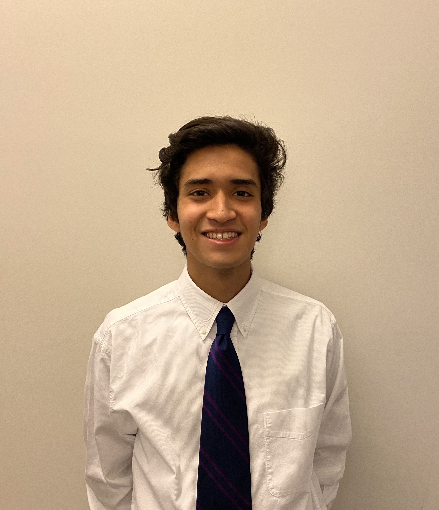

## About Me

#### _Welcome! Hola! Bonjour! こんにちは!_

I am a rising junior Computer Science major at Cornell University with a minor in Business. On campus, I serve as the Community Outreach Chair at [SHPE](https://www.shpe.cornell.edu/index.html) and am the President Elect for the upcoming 2020 - 2021 academic year. I am an active Fabrication team member of Cornell University's [Steel Bridge](https://steelbridge.engineering.cornell.edu/) project team, where I use machining tools to fabricate different steel components of our bridge for our yearly [competition](https://www.aisc.org/education/university-programs/student-steel-bridge-competition/).

## Experience

Last summer, I worked at [Technical Associates](https://www.technicalassociates.com/) as an Engineering Quality Assurance Intern. I was tasked with analyzing complex piping systems throughout our client's manufacturing plants and documenting the layout using P&ID (Piping and Instrumentation Diagrams) format within AutoCAD.

## Campus Involvement

I was an honorary recipient of Cornell University's [Tradition Fellow](https://commitment.cornell.edu/tradition) scholarship due to my participation as an active volunteer of the Ithaca community. 

I serve as the Resident Advisor (RA) at the Latino Living Center dorm on North Campus. My main duties include overseeing the welfare of my dorm's community and promoting a sense of culture by organizing activities such as cultural events, social gatherings, and academic enhancement workshops.

Lastly, I am an active brother in Cornell's chapter of Alpha Phi Omega, where I participate in social and volunteering events that aid the metro Ithaca area.

## Contact

Feel free to reach out with any questions you have at
[arc296@cornell.edu](mailto:arc296@cornell.edu) or connect with me on [LinkedIn](https://www.linkedin.com/in/alancaldera2022).
